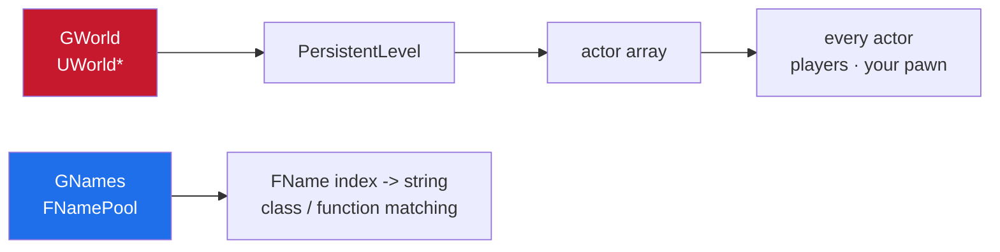
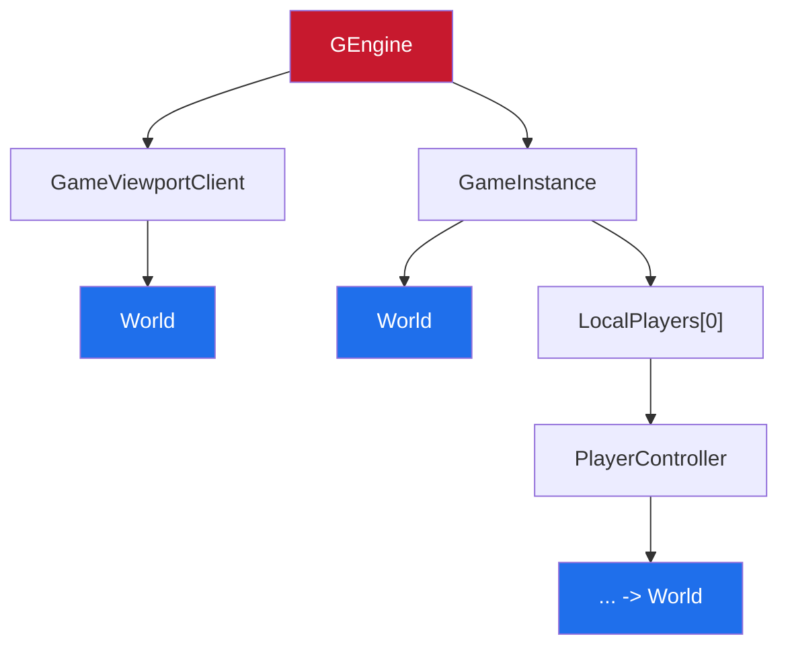
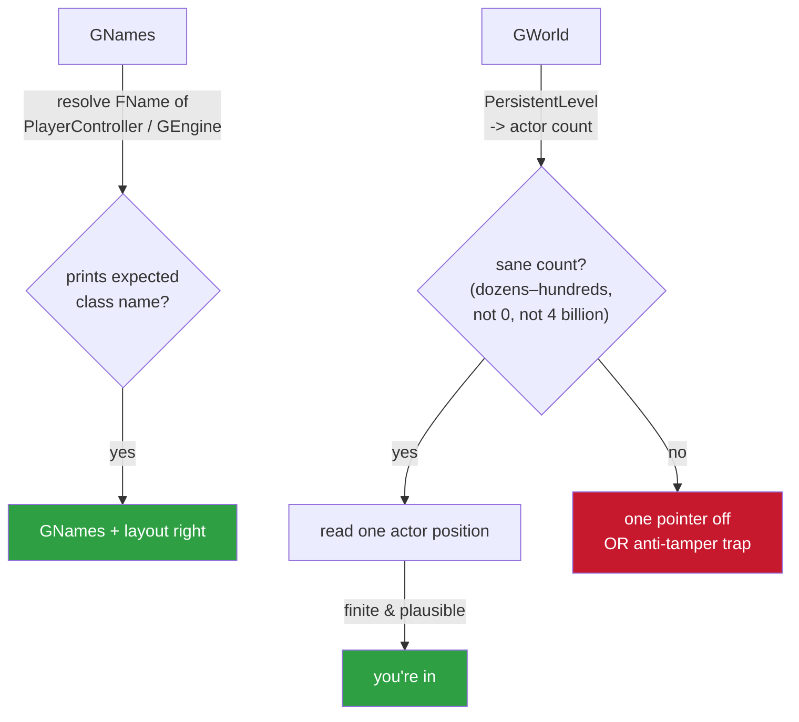

<h1 align="center">ue4-ios-gworld-gnames-notes</h1>

<p align="center">finding GWorld and GNames in a UE4 game on iOS — the two globals everything hangs off, and the anti-tamper traps around them</p>

<p align="center">
  
  
  
</p>

---

`GWorld` and `GNames` are the two globals everything else hangs off. `GWorld` gets
you into the live scene (actors, players, your pawn); `GNames` turns FName indices
into strings. Get these two and the rest of the SDK falls out.

> This is the arm64/iOS angle specifically — where you don't have the Windows tooling
> everyone's tutorials assume.

---

## contents

- [what they are](#what-they-are)
- [GNames, the easy one first](#gnames-the-easy-one-first)
- [GWorld, and why it's harder now](#gworld-and-why-its-harder-now)
- [the anti-tamper pointer trap](#the-anti-tamper-pointer-trap)
- [the "wrong binary in IDA" trap](#the-wrong-binary-in-ida-trap-this-ones-cheap-to-avoid)
- [verifying you actually got them](#verifying-you-actually-got-them)
- [order I do it in](#order-i-do-it-in)

---

## what they are

`GWorld` is a global `UWorld*`. From it: `PersistentLevel` → the actor array → every
actor in the scene. It's the root of a live read.

`GNames` (the name pool, `FNamePool` on 4.23+) is the interned-string table. You need
it to resolve any FName to text — so class filtering, function matching, all of it
depends on `GNames` being right.



Both are just pointers sitting in the binary's data. The job is finding the right
address, and on modern builds, not getting fooled by anti-tamper indirection.

---

## GNames, the easy one first

The name pool almost always resolves cleanly because so much code touches it. Two
ways:

**From the dump.** Whatever tool generated your SDK dump already located the name
pool to print names, so lift its address and layout from the dump's config/output. If
your dump has correct class and function names, its `GNames` is correct by
construction. Start here — it's free.

**From `FName::ToString` / `GetNames`.** Find a function that converts an FName to a
string (xref a plaintext name-ish log string, or find `objc`/error paths that print
names). It will index a global array, block-allocated on 4.23+:

```
entry = Pool.Blocks[index >> 16] + stride * (index & 0xFFFF)
```

The `Pool` base in that expression is `GNames`. Read it off the instruction that
loads it (an `ADRP`/`ADD` or a `LDR` from a data address). Confirm by resolving a
known index and checking you get a sane string. (Layout details are in my fname
notes.)

---

## GWorld, and why it's harder now

On older/naive builds `GWorld` is a fixed global you can read directly — one
`ADRP`+`LDR` and you're in. On a lot of current shipped games it isn't that simple:
the pointer is behind a chain or an anti-tamper accessor, and the value at the
"obvious" address is a decoy or is only valid after decode. **Don't assume the first
candidate is real.**

Ways to land it, roughly in order of how much I trust them:

### 1. Walk the engine chain instead of a raw global

Even when `GWorld` itself is hidden, `GEngine` (or the game instance) usually reaches
the world through a stable member chain:



Find `GEngine` (same technique — an accessor or a well-referenced global), then hop
the members. This survives builds where the bare `GWorld` global is obfuscated,
because the game itself has to traverse this chain to function.

### 2. From a function that clearly uses the world

Anything that spawns, line traces, or iterates actors dereferences the world early.
Xref such a function (a gameplay statics call, a trace) and watch where it loads its
`UWorld*` from. That load site points you at whatever holds the world — global or
chained.

### 3. Cross-check against a live pointer

If you can run in-process or attach, you're not guessing at all — read your
controller/pawn and walk *up*: pawn → player state / controller → the world it lives
in. Then match that runtime address back to the static location that produced it.

---

## the anti-tamper pointer trap

> [!WARNING]
> The one that eats days: on protected builds `GWorld` (and sometimes `GNames`) has
> **no single fixed address** — it's reached through an obfuscated pointer chain or an
> accessor that decodes/validates on each call. The value you read at the address the
> dump lists can be wrong, or right only sometimes.

If your world reads work for a second and then everything goes null, or every derived
actor is garbage, suspect this before you suspect your offsets.

**Handling it:** find the accessor the game itself calls to get the world, and
replicate exactly what it does (the same loads, the same decode), rather than reading
a raw global. Whatever the game does to get a valid `UWorld*` is the correct recipe by
definition.

---

## the "wrong binary in IDA" trap (this one's cheap to avoid)

> [!IMPORTANT]
> If you opened the wrong architecture slice, or rebased, or your image base is off,
> `GWorld` and `GNames` resolve to addresses that are **silently wrong** and everything
> downstream is noise.

I've burned hours on "my offsets are all wrong" that was just this. Confirm your image
base (iOS commonly `0x100000000`) and that you thinned to arm64 **before** you blame
the pointers.

---

## verifying you actually got them

Don't trust a value until it round-trips:



- **`GNames`:** resolve the FName of an object you can name (the local
  `PlayerController`, `GEngine`). If it prints the expected class, `GNames` and its
  layout are right.
- **`GWorld`:** read `PersistentLevel`, then the actor count. A sane count (dozens to
  a few hundred, not 0 and not 4 billion) means the world pointer and the level offset
  are right. Then read one actor's position — if it's finite and in a plausible range,
  you're in.

If the actor count reads as some huge number or zero every frame, you're either one
pointer off in the chain or you fell into the anti-tamper trap above.

---

## order I do it in

1. **`GNames` from the dump first** — free, and you need it to sanity-check everything
   else.
2. **`GEngine`**, then hop to the world through the chain rather than chasing a bare
   `GWorld` global.
3. **Verify** by walking to an actor and reading a position.
4. Only if the chain approach fails do I go looking for a raw `GWorld` global — and if
   I find one on a protected build, I treat it as **suspect until it round-trips**.

---

<p align="center">— shiedless</p>
